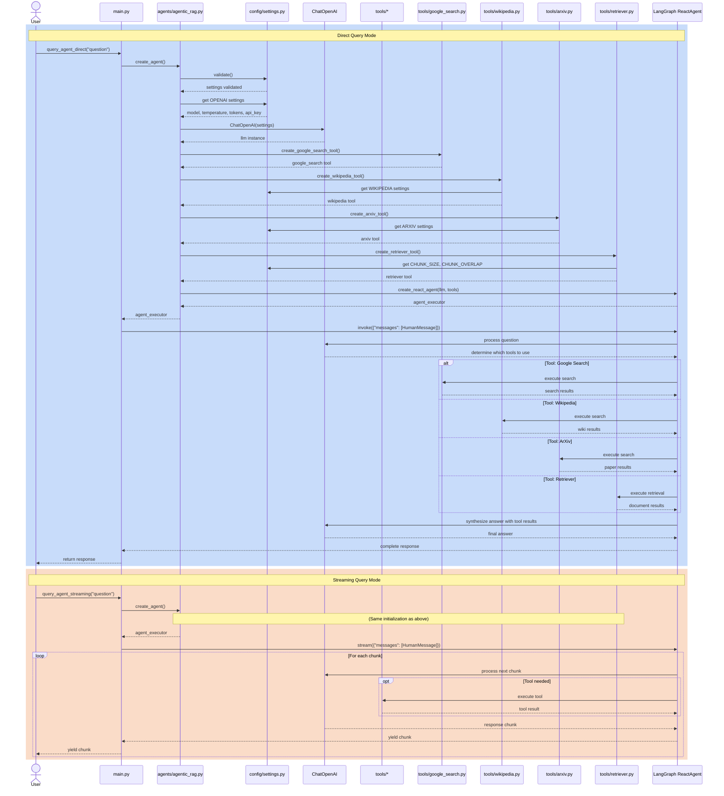

# Agentic RAG - Architecture Sequence Diagram

This document illustrates the sequence of interactions between the main entry point and various components in the Agentic RAG system.

## System Flow

The following Mermaid diagram shows how the `main.py` module interacts with agents, tools, and configuration components during both direct and streaming query modes.

## Component Responsibilities

### main.py
- Entry point for the application
- Provides two query interfaces: `query_agent_direct()` and `query_agent_streaming()`
- Manages user interaction and response formatting

### agents/agentic_rag.py
- Creates and configures the React agent
- Initializes the LLM with settings from config
- Orchestrates tool creation and registration
- Returns configured agent executor

### config/settings.py
- Loads environment variables from `.env` file
- Provides centralized configuration for all components
- Validates required settings (e.g., API keys)

### tools/*
Individual tool modules that provide specialized search capabilities:
- **google_search.py**: Real-time web search via Serper API
- **wikipedia.py**: Encyclopedia search
- **arxiv.py**: Academic paper search
- **retriever.py**: Custom document retrieval (LangSmith docs)

### LangGraph ReactAgent
- Orchestrates the conversation flow
- Decides which tools to call based on the question
- Synthesizes final answers using LLM and tool results
- Supports both direct invocation and streaming

## Query Modes

### Direct Mode
1. User calls `query_agent_direct()`
2. Agent is created with all tools
3. Question is sent via `invoke()`
4. Complete response is returned at once

### Streaming Mode
1. User calls `query_agent_streaming()`
2. Agent is created with all tools
3. Question is sent via `stream()`
4. Response chunks are yielded as they're generated
5. User can process each chunk in real-time

## Tool Selection

The ReactAgent automatically selects appropriate tools based on the question:
- **Current events/real-time info** → Google Search
- **General knowledge/topics** → Wikipedia
- **Academic papers** → ArXiv
- **LangSmith questions** → Retriever Tool

Multiple tools can be used in a single query if needed.
